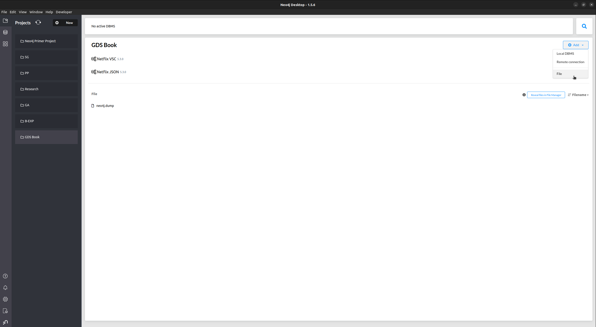
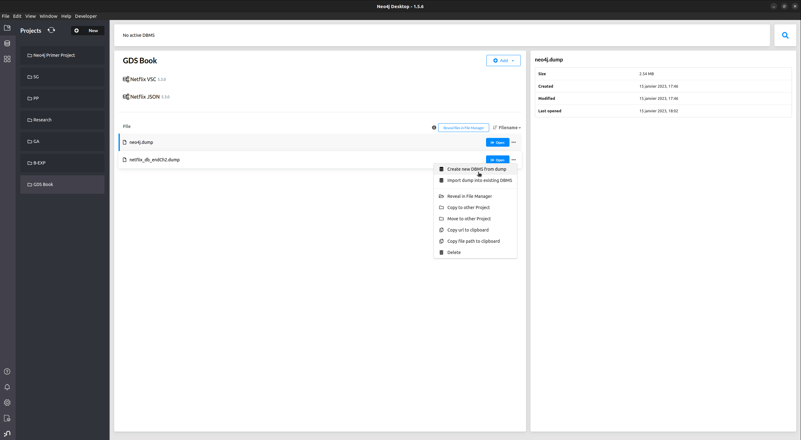
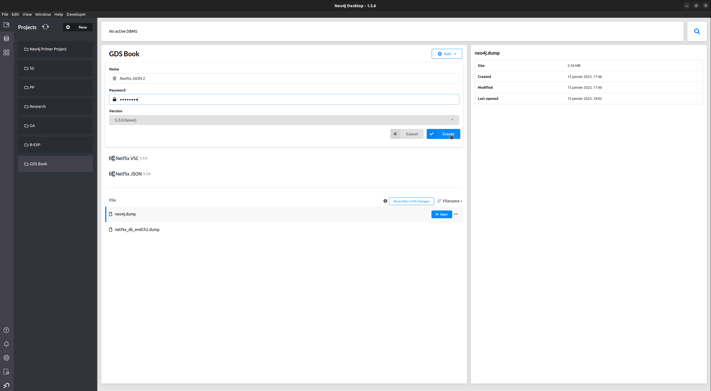

# Chapter 3: Characterizing a Graph Dataset

## Import database

The Netflix graph was created in chapter 2. 
In order to import it if you have not followed along Chapter 2, 
follow these steps:

1. Clone this repository
2. Open the Neo4j Desktop application
3. Click **Add | File**

4. Find the file `Chapter03/data/netflix_db_endCh2.dump` on your local filesystem and open it
5. Click the `...` next to the file **"Open"** button and click **"Create new DBMS from dump"**

6. Fill in the required information (db name and password). Make sure to select Neo4j version **5.3.0** (the version the dump from created from).

7. Click **"Create"**
8. Note: you need to **install the APOC plugin** for the rest of the chapter.
